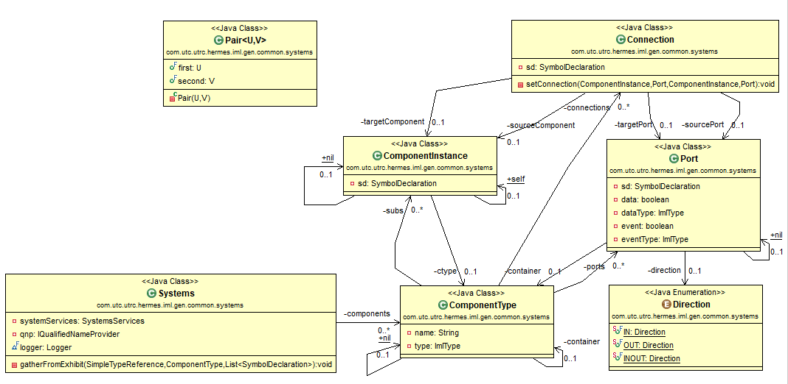
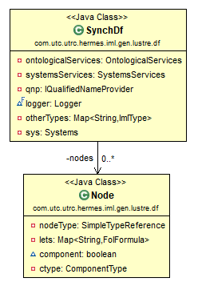
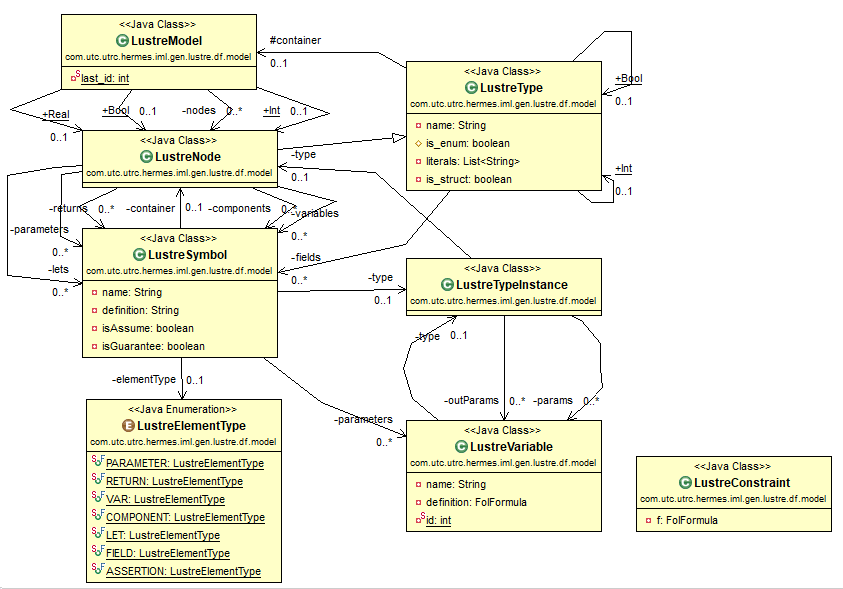

# IML to Lustre Generator: Introduction

The Lustre generator class `LustreGenerator` is defined in the following package:
 
    package com.utc.utrc.hermes.iml.gen.lustre.df.generator;

Programs described in IML are first read, parsed, and stored in a in-memory model of type `Model`. A new object of type `Systems` is constructed. The class `Systems` is defined in the following package:

    package com.utc.utrc.hermes.iml.gen.common.systems;

Type `Systems` maintains an internal data structure that maps from string identifiers to objects of `ComponentType`. Class `ComponentType` maintains the following private fields;  
- `name`, type of `String`
- `subs`, type of `Map<String, ComponentInstance>`
- `connections`, type of `Map<String, Connection> connections`
- `ports`, type of `Map<String, Port>`
- `type`, type of `ImlType`

Type `ComponentInstance` maintains the following private fields:
- `sd`, type of `SymbolDeclaration`
- `ctype`, type of `ComponentType`

Type `Connection` maintains the following private fields;  
- `sd`, type of `SymbolDeclaration`
- `sourceComponent` and `targetComponent`, type of `ComponentInstance`
- `sourcePort` and `targetPort`, type of `Port`

Type `Port` maintains the following private fields;  
- `sd`, type of `SymbolDeclaration`
- `direction`, type of `Direction`
- `data` and `event`, type of `boolean`
- `dataType` and `eventType`, type of `ImlType`

Type `Direction` is an `enum` of three values: `IN`, `OUT`, and `INOUT`.

The class `SynchDf` is defined in the following package:

    package com.utc.utrc.hermes.iml.gen.lustre.df;

Type `SynchDf` maintains the following private fields:
- `sys`, type of `Systems`
- `nodes`, type of `Map<String, Node>`
- `otherTypes`, type of `Map<String, ImlType>`

The class `Node` is defined in the following package:

    package com.utc.utrc.hermes.iml.gen.lustre.df;

Type `Node` maintains the following private fields:
- `nodeType`, type of `SimpleTypeReference`
- `lets`, type of `Map<String, FolFormula>`
- `component`, type of `boolean`
- `ctype`, type of `ComponentType`

The class `LustreModel` is defined in the following package:

    package com.utc.utrc.hermes.iml.gen.lustre.df.model;

Type `LustreModel` maintains the following private fields:
- `nodes`, type of `Map<String, LustreNode>`
- `last_id`, type of `int`

The class `LustreType` is defined in the same package. It maintains the following private fields:
- `name`, type of `String`
- `is_enum` and `is_struct`, type of `boolean`
- `literals`, type of `List<String>`
- `fields`, type of `Map<String, LustreSymbol>`

The class `LustreTypeInstance` is defined in the same package. It maintains the following private fields:
- `type`, type of `LustreNode`
- `params` and `outParams`, type of `List<LustreVariable>`

The class `LustreNode` is defined in the same package. It is a sub-class of `LustreType` and maintains the following additional private fields:
- `parameters` and `returns`, type of `List<LustreSymbol>`
- `variables`,`components`, and `lets`, type of `Map<String, LustreSymbol>`

The class `LustreSymbol` is defined in the same package. It maintains the following private fields:
- `elementType`, type of `LustreElementType`
- `name` and `definition`, type of `String`
- `type`, type of `LustreTypeInstance`
- `parameters`, type of `List<LustreVariable>`
- `isAssume` and `isGuarantee`, type of `boolean`

The class `LustreVariable` is defined in the same package. It maintains the following private fields:
- `name`, type of `String`
- `type, type of `LustreTypeInstance`
- `definition`, type of `FolFormula`

The class `LustreConstraint` is defined in the same package. It maintains the following private fields:
- `f`, type of `FolFormula`

Type `LustreElementType` is an `enum` of seven values: `PARAMETER`, `RETURN`, `VAR`, `COMPONENT`, `LET`, `FIELD`, `ASSERTION`.

