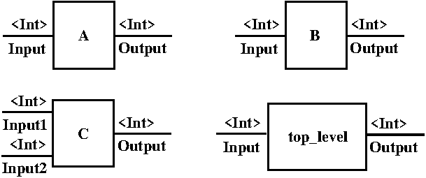
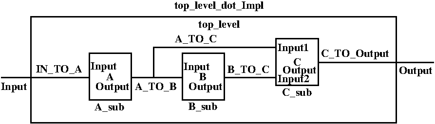

# IML to SMT Generator: Input
The SMT generator of HERMES takes in a program described in IML. The following is an example package defining a hierarchical system. 

    01  package smt.example;
    02  import iml.systems.*;
    03  import iml.software.*;
    04  import iml.contracts.*;
     
    05  trait ATrait refines(Component, Thread, Contract) {
    06      Input: InDataPort<Int>;
    07      Output: OutDataPort<Int>;
    08      [Assume{comment="A input domain"}] REQ1 : Bool := Input.data < 20;
    09      [Guarantee{comment="A output range"}] REQ2 : Bool := Output.data < 2 * Input.data;
    10      assumption: Bool := REQ1;
    11      guarantee: Bool := REQ2;	
    12  };
    13  type A exhibits(ATrait);
    
    14  trait BTrait refines(Component, Thread, Contract) {
	15      Input: InDataPort<Int>;
	16      Output: OutDataPort<Int>;
	17      [Assume{comment="B input domain"}] REQ1 : Bool := Input.data < 20;
    18      [Guarantee{comment="B output range"}] REQ2 : Bool := Output.data < Input.data + 15;
	19      assumption: Bool := REQ1;
	20      guarantee: Bool := REQ2;	
    21  };
    22  type B exhibits(BTrait);

    23  trait CTrait refines(Component, Thread, Contract) {
	24      Input1: InDataPort<Int>;
	25      Input2: InDataPort<Int>;
	26      Output: OutDataPort<Int>;
	27      [Guarantee{comment="C output range"}] REQ1 : Bool := Output.data = Input1.data + Input2.data;
	28      guarantee: Bool := REQ1;	
    29  };
    30  type C exhibits(CTrait);
    
    31  trait top_levelTrait refines(Component, Process, Contract) {
    32      Input: InDataPort<Int>;
    33      Output: OutDataPort<Int>;
    34      [Assume{comment="System input domain"}] REQ1 : Bool := Input.data < 10;
    35      [Guarantee{comment="System output range"}] REQ2 : Bool := Output.data < 50;
    36      assumption: Bool := REQ1;
    37      guarantee: Bool := REQ2;		
    38  };
    39  type top_level exhibits(top_levelTrait);
    
    40  type top_level_dot_Impl exhibits(top_levelTrait, Implements<top_level>){
    41      A_sub : A;
    42      B_sub : B;
    43      C_sub : C;
    44      IN_TO_A : Connector<InDataPort<Int>, InDataPort<Int>> := connect<InDataPort<Int>, InDataPort<Int>>(Input, A_sub.Input);
    45      assert{Input.data = A_sub.Input.data};
    46      A_TO_B : Connector<OutDataPort<Int>, InDataPort<Int>> := connect<OutDataPort<Int>, InDataPort<Int>>(A_sub.Output, B_sub.Input);
    47      assert{A_sub.Output.data = B_sub.Input.data};
    48      A_TO_C : Connector<OutDataPort<Int>, InDataPort<Int>> := connect<OutDataPort<Int>, InDataPort<Int>>(A_sub.Output, C_sub.Input1);
    49      assert{A_sub.Output.data = C_sub.Input1.data};
    50      B_TO_C : Connector<OutDataPort<Int>, InDataPort<Int>> := connect<OutDataPort<Int>, InDataPort<Int>>(B_sub.Output, C_sub.Input2);
    51      assert{B_sub.Output.data = C_sub.Input2.data};
    52      C_TO_Output : Connector<OutDataPort<Int>, OutDataPort<Int>> := connect<OutDataPort<Int>, OutDataPort<Int>>(C_sub.Output, Output);
    53      assert{C_sub.Output.data = Output.data};
    54  };

Similar to the Java programming language, the package `package smt.example` is declared at the beginning of the program. 
Then those relevant packages that are needed are imported. In this example, three library packages (`iml.systems`, `iml.software` and `iml.contracts`) are imported. 

An IML `Model` consists of its own package name, zero or more imports of type `Import` and zero or more symbols of type `Symbol`. 
Similar to the Java programming language, an IML `Import` is introduced by keyword `import`. 
An IML `Symbol` can be a `SymbolDeclaration`, a `NamedType`, an `Annotation`, a `Trait`, a `dataType` or an `Assertion`. 
A `SymbolDeclaration` can be a template with type parameters and its property list is optional. 
A `NameType`, `Datatype` or `Trait` can be a template with type parameters. 
They are introduced respectively by the keyword `type`, `datatype` and `trait`, followed by an optional property list, name identifier, template information if template, zero or more relations of `Relation`. 
Its main body, enclosed by `{` and `}`, includes zero or more symbols of `SymbolDeclaration` and `Assertion`. 
An `Assertion` is introduced by the keyword `assert`, followed by an optional property list, an optional comment, an optional identifier and a definition. 
A `Relation` can be an `Inclusion` (introduced by the keyword `includes`), a `Refinement` (introduced by the keyword `refines`), an `Alias` (introduced by the keyword `is`) or a `TraitExhibition` (introduced by the keyword `exhibits`).  

There are four traits (`ATrait`, `BTrait`, `CTrait` and `top_levelTrait`) in the above example. 
All of them refine `Component` and `Contract`, which are respectively traits defined in packages `iml.systems` and `iml.contracts`. 
Furthermore, traits `ATrait`, `BTrait` and `CTrait` all refine `Thread` while trait `top_levelTrait` refines `Process`. 
In their bodies, their communication interfaces are first defined via `SymbolDeclaration`. 
All their input ports are template type `InDataPort<DataType>`, as defined in package `iml.systems`, with template parameter to be `Int`. 
Similarly, all their output ports are template type `OutDataPort<DataType>` with template parameter to be `Int`. 
A `SymbolDeclaration`, preceded with a property list with annotation `Assume` as defined in package `iml.contracts`, introduces a variable of type `Bool` to specify the required legitimate domain of an input. 
Similarly, a 'SymbolDeclaration', preceded with a property list with annotation `Guarantee` as defined in package `iml.contracts`, introduces a variable of type `Bool` to specify the required legitimate range of an output. 
Lastly, the `assumption` and `guarantee` inherited from `trait Contract` are initialized as the corresponding variables introduced above. 

Four types (`A`, `B`, `C`, and `top_level`) are defined via the respective `exhibits` relation. The above figure shows the schematics of the types of the corresponding example. 

The above figure shows the hierarchical composition information of the system `top_level_dot_Impl`. 
